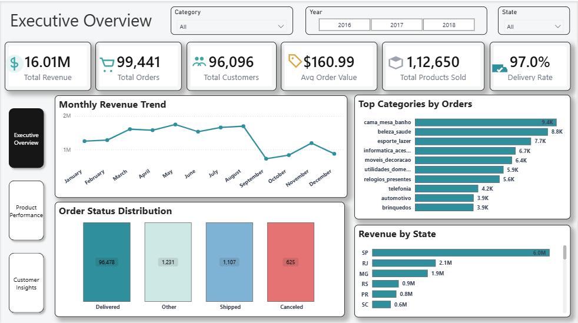
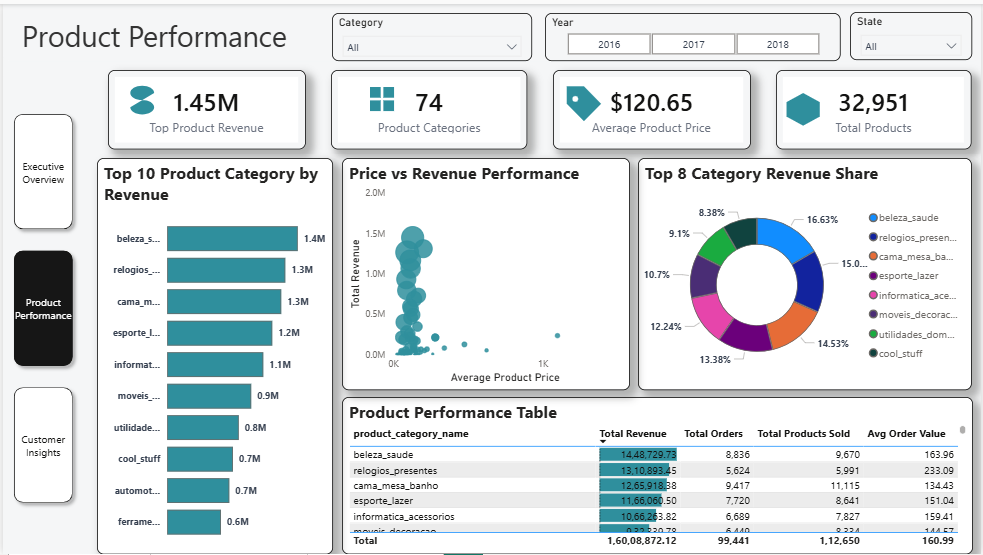
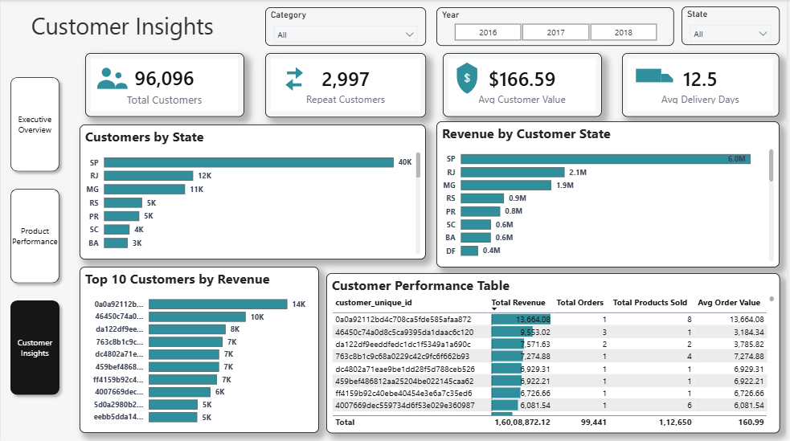

# E-commerce Sales Analysis Dashboard

## Project Overview
This project analyzes an e-commerce dataset to understand sales performance, product performance, and customer behavior using SQL and Power BI.

The dashboard provides insights into revenue trends, top product categories, and customer purchasing patterns.

---

## Tools Used
- SQL
- Power BI
- Data Visualization
- Data Cleaning
- Business Intelligence

---

## Dashboard Pages

### Executive Overview
Shows high-level business KPIs.

Metrics:
- Total Revenue
- Total Orders
- Total Customers
- Average Order Value
- Delivery Rate

---

### Product Performance
Analyzes product category performance.

Insights:
- Top product categories by revenue
- Category revenue share
- Price vs revenue analysis

---

### Customer Insights
Analyzes customer behavior.

Insights:
- Repeat customers
- Revenue by customer state
- Top customers by revenue
- Customer performance table

---

## Dashboard Preview

## Executive Overview

## Product Performance

## Customer Insights

---
## Download Power BI File

Due to GitHub file size limits, the Power BI dashboard file is hosted externally.

Download the PBIX file here:

[Download PBIX File](https://drive.google.com/file/d/1AFNpWA-HAyRW2BZl62l7mVeVNOHeSERG/view?usp=drive_link)

## Key Insights

- Total revenue generated: **$16M**
- 96K total customers
- 112K products sold
- Top category driving revenue: **Beauty & Health**
- Strong customer concentration in **SP and RJ states**

---

## Author

Ajay Thakur  
Freelance Data Analyst  
Skills: Power BI, Excel, SQL
